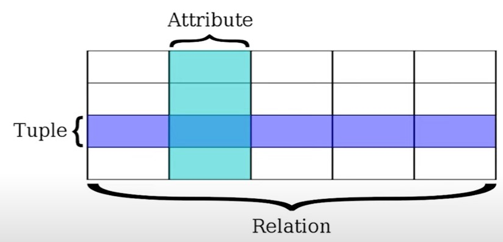
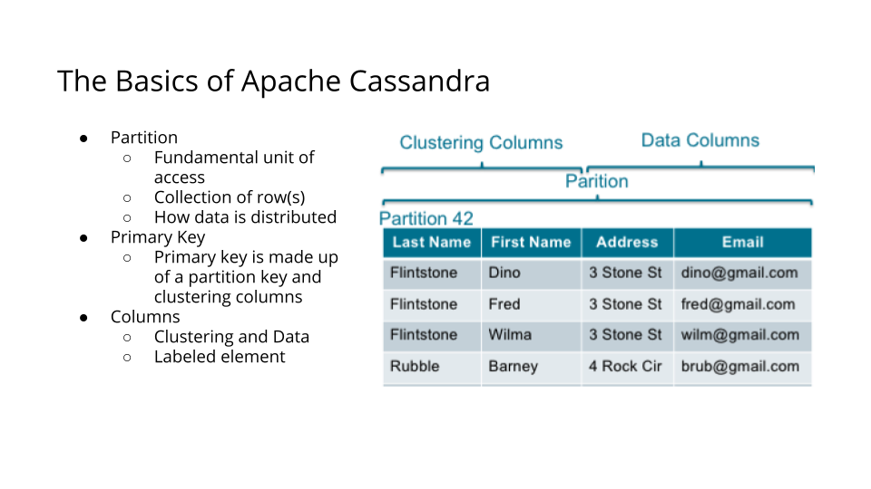

# Data Engineering with AWS

Welcome!

This repo is meant to be used as a notes bank for the [Data Engineering with AWS](https://www.udacity.com/course/data-engineer-nanodegree--nd027) nanodegree program by [Udacity](https://learn.udacity.com/).

---
## Introduction to Data Modeling
---
### What is Data Modeling?
> "... an abstraction that **organizes elements of data** and **how** they will **relate** to each other" -- Wikipedia

> "Data modeling is the **process of creating a visual representation** or a blueprint that defines the **information collection and management systems** of any organization. This blueprint or data model helps different stakeholders, like data analysts, scientists, and engineers, to create a unified view of the organization's data. The model **outlines what data the business collects, the relationship between different datasets, and the methods that will be used to store and analyze the data**." -- AWS

> "Data modeling is the **process of creating a visual representation** of either a whole information system or parts of it **to communicate connections** between data points and structures." -- IBM

Data modeling is a process to support both your business and your user applications. These two needs are particularly different. 

For example, let's say we owned an online store. We will need to store data so that we can understand how much stock we sold of a particular item. This is a business process, and we'll also need to store information about our customers as they'd log onto our website, a user application. 

* **Process to Support Business and Users Applications**
To begin a data modeling process, the team must gather requirements from the application team, the business users, and our end users to understand that data must be retained and served as a business or the end-users. 

* **Gather Requirements**
First, we need to map out that our data must be stored and persisted, and how that data will relate to each other. Next, we want to focus on conceptual data modeling. 

* **Conceptual Data Modeling**
The process of doing actual data modeling, starts with conceptual data modeling with entity mapping. This can be done actually by hand, or by using many tools to do this work. Conceptual data modeling is mapping the concepts of the data that you have or will have. 
According to [AWS](https://aws.amazon.com/what-is/data-modeling/), conceptual data models give a big picture view of data. They explain the following:
	* What data the system contains
	* Data attributes and conditions or constraints on the data
	* What business rules the data relates to
	* How the data is best organized
	* Security and data integrity requirements

* **Logical Data Modeling**
Logical data modeling is done where the contectual models are mapped to logical models using the concept of tables, schemas, and columns. According to [AWS](https://aws.amazon.com/what-is/data-modeling/), they give more details about the data concepts and complex data relationships that were identified in the conceptual data model, such as these:
	* Data types of the various attributes (for example, string or number)
	* Relationships between the data entities
	* Primary attributes or key fields in the data

Data architects and analysts work together to create the logical model. They follow one of several formal data modeling systems to create the representation. Sometimes agile teams might choose to skip this step and move from conceptual to physical models directly. However, these models are useful for designing large databases, called data warehouses, and for designing automatic reporting systems.

* **Physical Data Modeling**
Physical data modeling is done transforming the logical data modeling to the database's *Data Definition Language*, or **DDL** to be able to create the databases, the tables and the schemas. According to [AWS](https://aws.amazon.com/what-is/data-modeling/), physical data models map the logical data models to a specific DBMS technology and use the software's terminology. For example, they give details about the following:
	* Data field types as represented in the DBMS
	* Data relationships as represented in the DBMS
	* Additional details, such as performance tuning

---
### Why is Data Modeling Important?
---
According to [AWS](https://aws.amazon.com/what-is/data-modeling/), organizations today collect a large amount of data from many different sources. However, **raw data is not enough**. You need to *analyze data for actionable insights that can guide you to make profitable business decisions*. Accurate data analysis needs efficient **data collection, storage, and processing**. There are several database technologies and data processing tools, and different datasets require different tools for efficient analysis.

* **Data Organization:** The organization of the data for your applications is extremely important and makes everyone's life easier.
* **Use cases:** Having a well thought out and organized data model is critical to how that data can later be used. Queries that could have been straightforward and simple might become complicated queries if data modeling isn't well thought out.
* **Starting early:** Thinking and planning ahead will help you be successful. This is not something you want to leave until the last minute.
* **Iterative Process:** Data modeling is not a fixed process. It is iterative as new requirements and data are introduced. Having flexibility will help as new information becomes available.

---
## Introduction to Relational Databases
---

### Relational Model
This model **organizes data** into one or morte **tables** (or "relations") of **columns and rows**, with a **unique key* identifying each row. Generally, each table represents one "entity type" (such as customer or product).

> "A **relational database** (term invented by *Edgar Codd* in 1970) is a digital database **based on the relational model** of data... a software system used to maintain relational databases is a *relational database management system* (**RDBMS**)." --Wikipedia

> "**SQL** (*Structured Query Language*) is the language used across almost all relational database system for querying and maintaining the database." --Wikipedia

**Common Types of Relational Databases:**
* *Oracle:* Used by almost every enterprise as their system of truth that handles *ACID* transactions. For example, banking systems run on Oracle.
* *Teradata*
* *MySQL*
* *PostgreSQL*
* *Sqlite:* Is a database in file format, and is generally used in development of extremely simple tasks in an application.

**To summarize:**
* **Database/Schema:** Collection of tables.
* **Tables/Relations:** Group of rows sharing the same labeled elements.

### Advantages of using a Relational Database
* **Flexibility for writing in SQL queries:** With SQL being the most common database query language.
* **Modeling the data** not modeling queries
* **Ability to do JOINS**
* **Ability to do aggregations and analytics**
* **Secondary Indexes available :** You have the advantage of being able to add another index to help with quick searching.
* **Smaller data volumes:** If you have a smaller data volume (and not big data) you can use a relational database for its simplicity.
* **ACID Transactions:** Allows you to meet a set of properties of database transactions intended to guarantee validity even in the event of errors, power failures, and thus maintain data integrity.
* **Easier to change to business requirements**

#### ACID Transactions

> "... properties of database transactions intended to **guarantee validity** even in the event of **errors, power failures**..." --Wikipedia

* **Atomicity:** <u>The whole transaction is processed or nothing is processed</u>. A commonly cited example of an atomic transaction is money transactions between two bank accounts. The transaction of transferring money from one account to the other is made up of two operations. First, you have to withdraw money in one account, and second you have to save the withdrawn money to the second account. An atomic transaction, i.e., when either all operations occur or nothing occurs, keeps the database in a consistent state. This ensures that if either of those two operations (withdrawing money from the 1st account or saving the money to the 2nd account) fail, the money is neither lost nor created. Source: [Wikipedia](https://en.wikipedia.org/wiki/Atomicity_%28database_systems%29) for a detailed description of this example.
* **Consistency:** <u>Only transactions that abide by constraints and rules are written into the database, otherwise the database keeps the previous state</u>. The data should be correct across all rows and tables. Check out additional information about consistency on [Wikipedia](https://en.wikipedia.org/wiki/Consistency_%28database_systems%29).
* **Isolation:** <u>Transactions are processed independently and securely, order does not matter</u>. A low level of isolation enables many users to access the data simultaneously, however this also increases the possibilities of concurrency effects (e.g., dirty reads or lost updates). On the other hand, a high level of isolation reduces these chances of concurrency effects, but also uses more system resources and transactions blocking each other. Source: [Wikipedia](https://en.wikipedia.org/wiki/Isolation_%28database_systems%29)
* **Durability:** <u>Completed transactions are saved to database even in cases of system failure</u>. A commonly cited example includes tracking flight seat bookings. So once the flight booking records a confirmed seat booking, the seat remains booked even if a system failure occurs. Source: [Wikipedia](https://en.wikipedia.org/wiki/Durability_%28database_systems%29).

#### When Not to Use a Relational Database
* **Have large amounts of data:** Relational Databases are not distributed databases and because of this they can only scale vertically by adding more storage in the machine itself. You are limited by how much you can scale and how much data you can store on one machine. You cannot add more machines like you can in NoSQL databases.
* **Need to be able to store different data type formats:** Relational databases are not designed to handle unstructured data.
* **Need high throughput -- fast reads:** While ACID transactions bring benefits, they also slow down the process of reading and writing data. If you need very fast reads and writes, using a relational database may not suit your needs.
* **Need a flexible schema:** Flexible schema can allow for columns to be added that do not have to be used by every row, saving disk space.
* **Need high availability:** <u>High availability describes a database where there is very little downtime of the system, it is always on and functioning.</u> The fact that relational databases are not distributed (and even when they are, they have a coordinator/worker architecture), they have a single point of failure. When that database goes down, a fail-over to a backup system occurs and takes time.
* **Need horizontal scalability:** Horizontal scalability is the <u>ability to add more machines or nodes to a system</u> to increase performance and space for data.

## Introduction to PostgreSQL

PostgreSQL is an open-source object-relational database system.

-   PostgreSQL uses and builds upon SQL database language by providing various features that reliably store and scale complicated data workloads.
-   PostgreSQL SQL syntax is different than other relational databases SQL syntax.

All relational and non-relational databases tend to have their own SQL syntax and operations you can perform that are different between types of implementations. This note is just to make you aware of this, this course is focused on data modeling concepts.

## Introduction to NoSQL Databases
> _"A NoSQL database  has a simpler design, simpler horizontal scaling, and finer control of availability. Data structures used are different than those in Relational Databases: they make some operations faster." --Wikipedia_

NoSQL databases were created do some of the issues faced with Relational Databases. NoSQL databases have been around since the 1970’s but they became more popular in use since the 2000’s as data sizes has increased, and outages/downtime has decreased in acceptability.

**NoSQL Database Implementations:**

-   Apache Cassandra (Partition Row store)
-   MongoDB (Document store)
-   DynamoDB (Key-Value store)
-   Apache HBase (Wide Column Store)
-   Neo4J (Graph Database)

